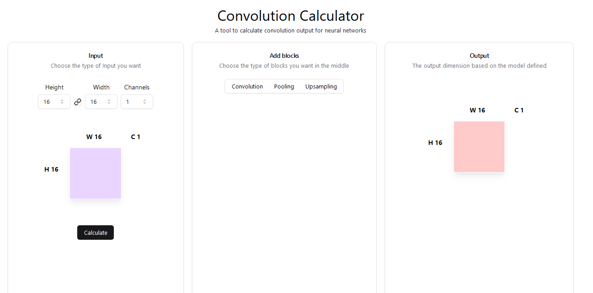

# Deep convolution (2D, 3D, VAEs) calculator for all.

I have personally faced this as a challenge when trying to manually calculate all the conv operations required and what dimensions, latent dimensions, stride, padding etc to use to get the desired output. So I have decided to make a one for all tool (might need some work even when complete :)
I hope this will help others implementing deep learning models

### Simple calculator that meets all deep learning training requirements.

Currently WIP....
[Please check out the current prod build here!!](https://conv-calculator.vercel.app/)

